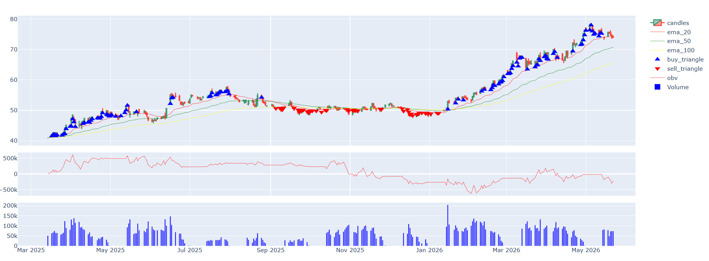
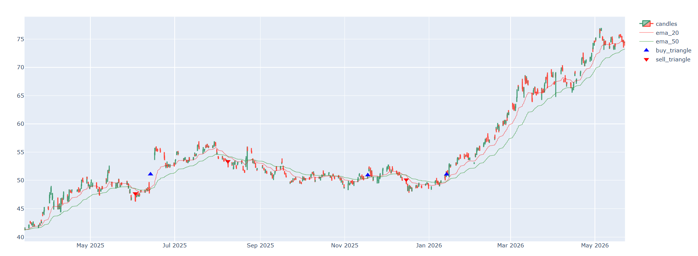
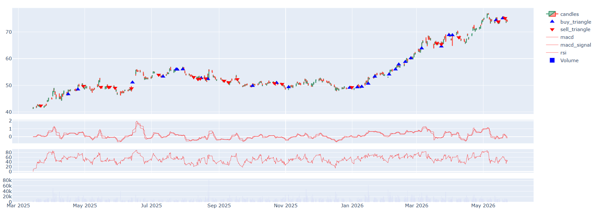
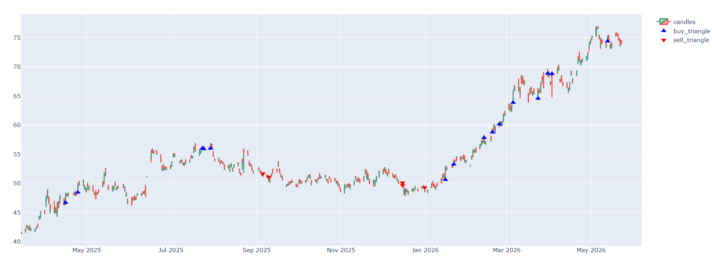
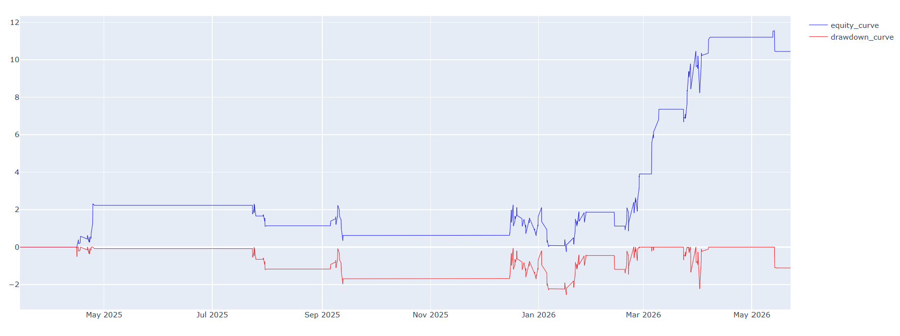
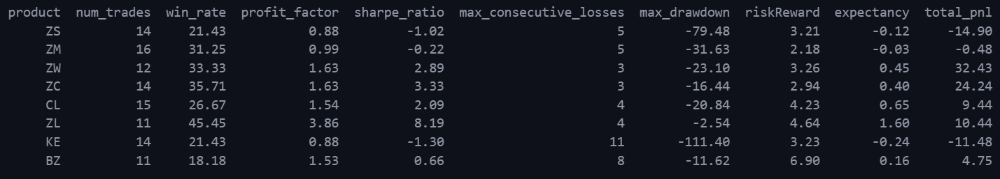

# Multi-Timeframe Systematic Trading Strategy for Commodity Futures

## Overview

Having traded commodity futures professionally for over 2 years, I consistently struggled with one problem — emotional interference. I had strategies that made sense, but between entering a position and exiting it, emotions took over. I booked profits too early and held losses too long, dragging stops when I shouldn't have.

This project is my attempt to solve that. I took one of my core trading approaches and systematized it completely — removing discretion, defining every entry, exit, stop and target algorithmically, and backtesting it across multiple commodity futures to find out whether the underlying logic actually had edge.

---

## Strategy Logic

The strategy operates in three layers:

### Layer 1 — Daily Trend Filter

Identifies the long term market direction using two indicators on the daily chart. If price is trading above EMA 20, 50 and 100 simultaneously, and OBV is trending upward, the bias is bullish. The reverse defines bearish. No signal is taken against this bias.



### Layer 2 — Entry Signal Generation (240min and 60min)

Once daily bias is established, the strategy looks for entry signals on lower timeframes:

- **240min** — EMA 20/50 crossover generates directional signal
- **60min** — Three conditions must be met simultaneously: MACD crossover, RSI above 50, and volume above 20 bar average

Either timeframe generating a signal in the direction of the daily bias triggers an entry. More conditions are required on the lower timeframe to filter out false signals.





### Layer 3 — Trade Execution and Risk Management

- Entry on next candle open after signal fires
- Stop loss at 1.5x ATR from entry
- Target at 5x ATR from entry — asymmetric risk reward by design
- Exit triggers automatically at target, stop, or on opposing signal

---

## Backtesting Methodology

The backtester simulates real trading conditions bar by bar on 60min data:

- Target and stop checked on every candle before processing new signals
- Entries executed on next bar open to avoid lookahead bias
- ATR calculated dynamically on each bar
- Equity curve and drawdown tracked continuously, not just on trade close

## 

## Results

Tested on 8 commodity futures over 14 months of data (March 2025 — May 2026):

| Product | Trades | Win Rate | Profit Factor | Sharpe | Max Consec. Losses | Max Drawdown | Risk Reward | Expectancy | Total PnL |
| ------- | ------ | -------- | ------------- | ------ | ------------------ | ------------ | ----------- | ---------- | --------- |
| ZS      | 14     | 21.43%   | 0.88          | -1.02  | 5                  | -79.48       | 3.21        | -0.12      | -14.90    |
| ZM      | 16     | 31.25%   | 0.99          | -0.22  | 5                  | -31.63       | 2.18        | -0.03      | -0.48     |
| ZW      | 12     | 33.33%   | 1.63          | 2.89   | 3                  | -23.10       | 3.26        | 0.45       | +32.43    |
| ZC      | 14     | 35.71%   | 1.63          | 3.33   | 3                  | -16.44       | 2.94        | 0.40       | +24.24    |
| CL      | 15     | 26.67%   | 1.54          | 2.09   | 4                  | -20.84       | 4.23        | 0.65       | +9.44     |
| ZL      | 11     | 45.45%   | 3.86          | 8.19   | 4                  | -2.54        | 4.64        | 1.60       | +10.44    |
| KE      | 14     | 21.43%   | 0.88          | -1.30  | 11                 | -111.40      | 3.23        | -0.24      | -11.48    |
| BZ      | 11     | 18.18%   | 1.53          | 0.66   | 8                  | -11.62       | 6.90        | 0.16       | +4.75     |

**6 out of 8 products profitable.** ZL (Soybean Oil) shows exceptional performance with Sharpe ratio of 8.19, profit factor of 3.86 and maximum drawdown of just -2.54 points. The strategy works best in trending commodity markets with clear directional bias.

## 

## Project Structure

Project/
├── helper_functions/
│ ├── data_loader.py # Downloads daily, 240min, 60min OHLCV data from yfinance
│ ├── trend_filter.py # Layer 1 - Daily EMA + OBV trend direction filter
│ ├── signal_ema_crossover.py # Layer 2 - 240min EMA 20/50 crossover signal
│ ├── signal_macd_rsi.py # Layer 2 - 60min MACD + RSI + Volume signal
│ ├── trades_generator.py # Backtester with ATR based stops, targets and equity tracking
│ ├── backtest_metrics_func.py # Performance metrics - Sharpe, Sortino, profit factor etc
│ └── plotChart.py # Interactive Plotly charts with signal visualization
├── indicators/
│ ├── ema.py # Exponential Moving Average
│ ├── macd.py # Moving Average Convergence Divergence
│ ├── rsi.py # Relative Strength Index
│ ├── atr.py # Average True Range
│ ├── obv.py # On Balance Volume
│ └── bollinger_bands.py # Bollinger Bands
└── main.ipynb # Orchestrates full pipeline end to end

---

## Installation

```bash
pip install pandas numpy yfinance plotly matplotlib openpyxl
```

---

## Usage

1. Clone the repository
2. Install dependencies
3. Open `main.ipynb`
4. Run all cells — data downloads automatically from yfinance
5. Modify `product_list` to test on different futures contracts
6. Modify `target_factor` and `stop_factor` in `trades_generator` call to experiment with risk parameters

---

## Tech Stack

- **Python** — pandas, numpy
- **Data** — yfinance (free EOD and intraday futures data)
- **Visualization** — Plotly (interactive charts), Matplotlib
- **Backtesting** — custom built, bar by bar simulation

---

## Key Design Decisions

- **Top down approach** — daily filter prevents trading against the major trend
- **OR logic on entry** — either 240min or 60min signal is sufficient, making the strategy more responsive without sacrificing the daily filter
- **ATR based risk management** — stops and targets adapt to market volatility automatically
- **Lookahead bias prevention** — 240min signal reindexed and forward filled onto 60min index, entries always on next bar open

---

## Future Work

- Add fundamental layer using calendar spread direction as supply/demand proxy — nearby contract stronger than deferred = bullish bias
- Parameter sensitivity analysis across ATR multipliers and EMA periods
- Walk forward testing for out of sample validation
- Expand universe to equity futures and crypto
- Portfolio level backtesting across multiple products simultaneously

---

## About

Built by Harsh Pandey — former commodity futures trader at Futures First, now building systematic trading tools to quantify and validate discretionary trading intuition.
